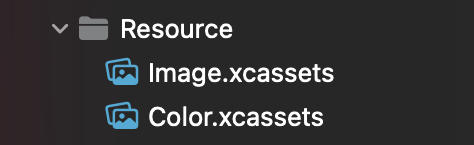
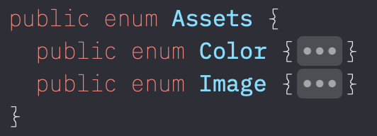

# BCResource

`Burstcamp`의 Resource를 담당하는 Module입니다.

SwiftGen을 활용해 선언적인 코드를 작성할 수 있습니다.

UIKit extension을 통해서 쉽게 Resource를 사용할 수 있습니다.

## How to use

1. SwiftGen을 설치합니다.

   ```bash
   brew install swiftgen
   ```

1. `Resource` 디렉토리에 Asset을 추가합니다.
   * 추가하고자 하는 asset의 종류에 따라서 분류합니다.
   * 예를 들어, Color는 `Color` 디렉토리에, Image는 `Image` 디렉토리에 추가할 수 있습니다.
   * 추가적인 분류가 필요하다면, 새로운 asset 디렉토리를 추가합니다.
   * 디렉토리의 이름에 맞춰 `enum`이 생성됩니다.  
     

1. 새로 추가된 파일이 `Assets`, `Font`가 아니라면 yml파일을 수정합니다.
   * 수정을 위해서는 [swiftgen.yml 템플릿](https://github.com/SwiftGen/SwiftGen/tree/stable/Documentation/templates)을 참고할 수 있습니다.

1. Build
   * Build Phase에 추가된 SwiftGen 스크립트를 통해 자동으로 코드가 생성됩니다.
   * 생성된 코드는 `Generated` 디렉토리에서 확인할 수 있습니다.

1. 앱에서 활용할 수 있도록 생성된 코드로 `extension`을 작성합니다.
   * 파일 이름은 `<Type>Set.swift`입니다.
   * 아래는 코드의 예시입니다.

     ```swift
     // ImageSet.swift

     public extension UIImage {
        static let burstcamper = Assets.Image.burstcamper100.image
        static let github = Assets.Image.github.image
     }
     ```
